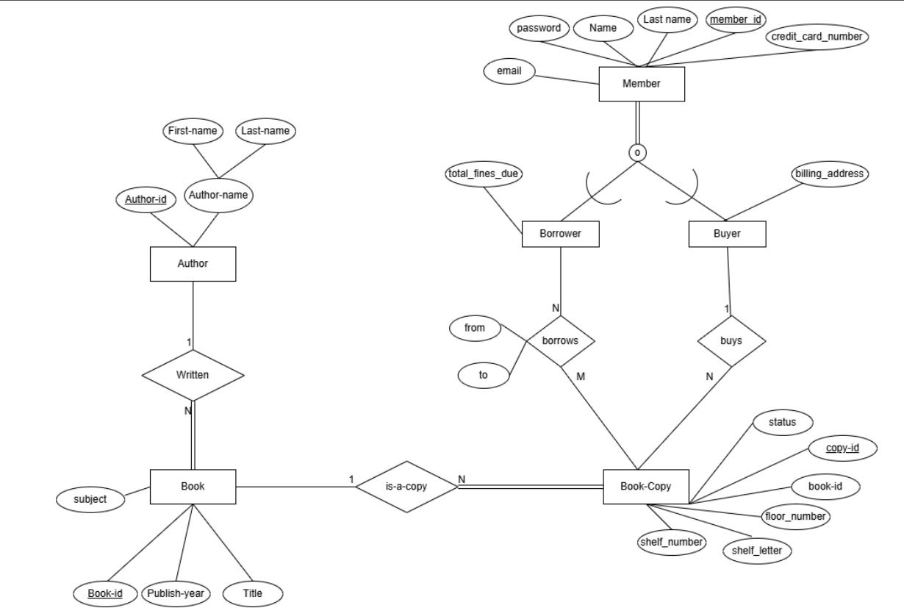

# 📚 Library Management System

A Java-based Library Management System that streamlines the process of lending and purchasing books.  
The system integrates **real-world book data from the OpenLibrary API**, features a **normalized relational database design**, and includes **advanced SQL queries** for library administration insights.

---

## Features

- 📖 Search and view books with availability
- 👤 Register library members (borrowers or buyers)
- 📚 Track borrowing and purchasing activities
- 🏷️ Manage book copies with shelf and floor locations
- 📊 Generate statistical reports with advanced SQL queries
- 🔑 Secure member login and purchase tracking

---

## Tech Stack

- **Database**: MySQL (AWS RDS)  
- **Backend**: Java (Maven Project)  
- **Frontend**: Java Swing GUI  
- **Dependencies**:  
  - `mysql-connector-java`  
  - `org.json`  
  - `jcalendar`  
- **External Data**: [OpenLibrary API](https://openlibrary.org/developers/api)

---

## Database Design

The system uses a **normalized relational schema** to ensure consistency and scalability.

- Distinguishes between **Borrowers** and **Buyers**
- Maintains **referential integrity** with cascading deletes
- Tracks **multiple copies of books** with precise shelf locations
- Includes **billing information** for buyers and **fine tracking** for borrowers

### Entity-Relationship Diagram



---

## 📈 Advanced SQL Queries

Below are examples of advanced queries used in the project:
<details>
<summary>1. Most Popular Authors of 2024</summary>
```sql
SELECT  
    a.author_id, 
    CONCAT(a.first_name, ' ', a.last_name) AS author_name, 
    COUNT(*) AS borrow_count, 
    (SELECT COUNT(*)  
     FROM Book b  
     WHERE b.author_id = a.author_id) AS total_books 
FROM Author a 
JOIN Book b ON a.author_id = b.author_id 
JOIN Book_Copy bc ON b.book_id = bc.book_id 
JOIN Borrows br ON bc.copy_id = br.copy_id 
WHERE YEAR(br.borrow_date) = 2024 
GROUP BY a.author_id, author_name 
ORDER BY borrow_count DESC 
LIMIT 5;
</details> ```

<details> 
<summary>2. Books Not Returned Yet</summary>
```sql
SELECT  
    B.title AS book_title, 
    BC.copy_id AS copy_id, 
    M.name AS borrower_name, 
    M.lastname AS borrower_lastname, 
    Bo.borrow_date, 
    Bo.due_date, 
    CASE  
        WHEN Bo.due_date < CURDATE() THEN DATEDIFF(CURDATE(), Bo.due_date) 
        ELSE 0 
    END AS days_overdue 
FROM Borrows Bo 
JOIN Book_Copy BC ON Bo.copy_id = BC.copy_id 
JOIN Book B ON BC.book_id = B.book_id 
JOIN Members M ON Bo.member_id = M.member_id 
WHERE Bo.return_date IS NULL 
ORDER BY days_overdue DESC;
</details>```

<details> 
<summary>3. Locations of Top 3 Books Per Subject</summary>
```sql
WITH BookPopularity AS ( 
    SELECT bc.book_id, COUNT(bw.copy_id) AS borrow_count
    FROM Borrows bw 
    JOIN Book_Copy bc ON bw.copy_id = bc.copy_id 
    GROUP BY bc.book_id 
), 
RankedBooks AS ( 
    SELECT b.subject, b.title, bp.book_id,
           ROW_NUMBER() OVER (PARTITION BY b.subject ORDER BY bp.borrow_count DESC) AS ranking
    FROM BookPopularity bp 
    JOIN Book b ON bp.book_id = b.book_id 
    WHERE b.subject IN ('textbooks', 'love', 'fiction') 
) 
SELECT tb.subject, tb.title, bc.copy_id,
       CONCAT('Floor ', bc.floor_number, ', Shelf ', bc.shelf_letter, bc.shelf_number) AS location,
       (SELECT COUNT(*) FROM Borrows WHERE copy_id = bc.copy_id) AS times_borrowed
FROM RankedBooks tb
JOIN Book_Copy bc ON tb.book_id = bc.book_id
WHERE ranking <= 3
ORDER BY tb.subject, tb.title;
</details>
```
